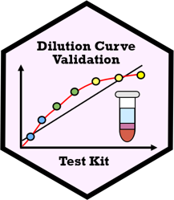
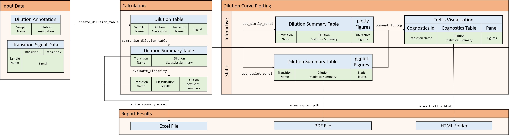
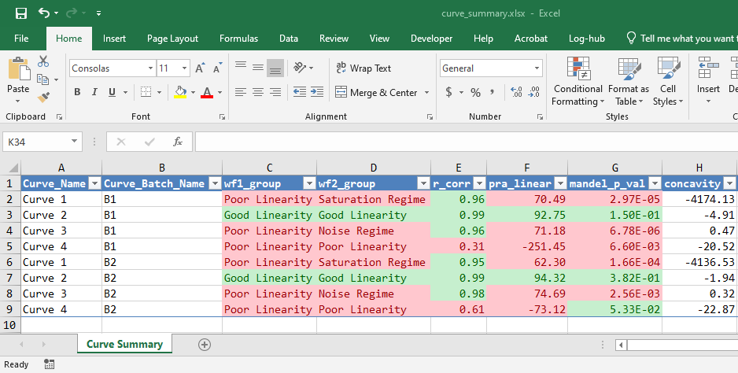
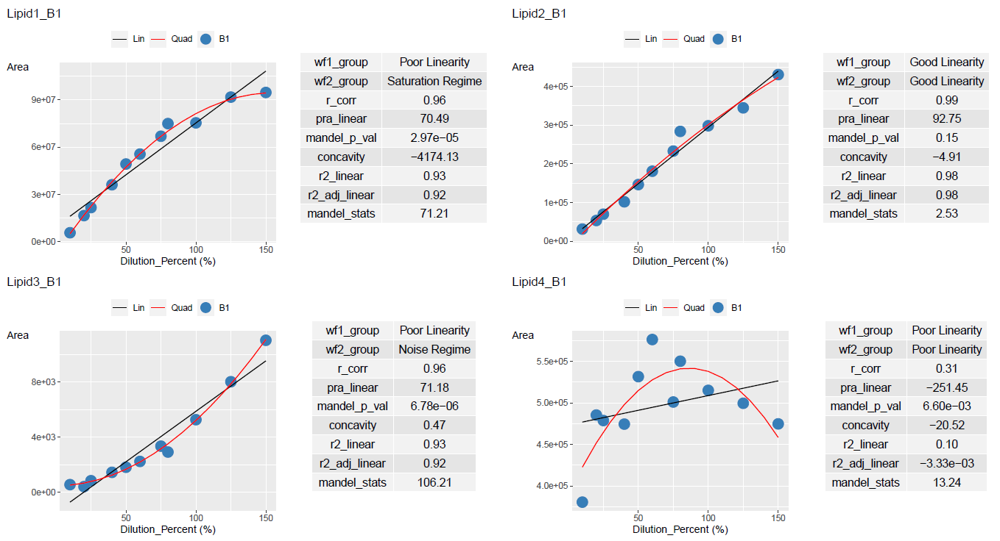
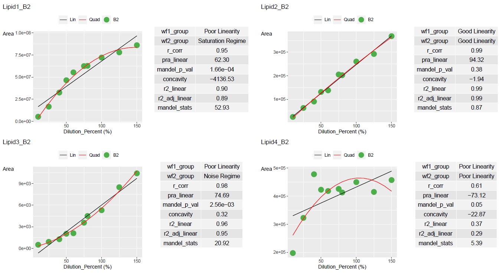
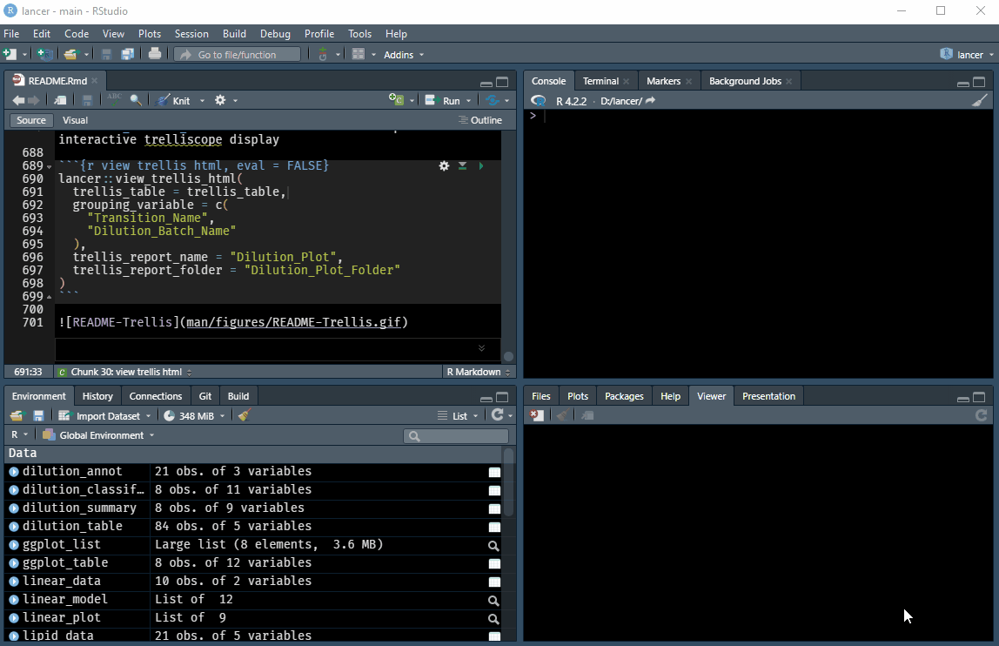

---
output:
  md_document:
    variant: gfm
---

<!-- README.md is generated from README.Rmd. Please edit that file -->

```{r, include = FALSE}
knitr::opts_chunk$set(
  collapse = TRUE,
  comment = "#>",
  fig.path = "man/figures/README-",
  out.width = "100%"
)
library(DCVtestkit)
```

# DCVtestkit (Dilution Curve Validation Testkit)


<!-- badges: start -->
[](https://github.com/SLINGhub/DCVtestkit/actions)
[](https://codecov.io/gh/SLINGhub/DCVtestkit)
[](https://github.com/SLINGhub/DCVtestkit/blob/main/LICENSE.md)
[](https://github.com/JauntyJJS)
<!-- badges: end -->

R package used to validate if a quality control sample dilution curve is linear or has signal suppression by statistical analysis and plots.

## Installation

You can install the development version from [GitHub](https://github.com/) with:

``` r
# install.packages("devtools")
devtools::install_github("SLINGhub/DCVtestkit")
```

If this repository is private, go to this [link](https://maurolepore.netlify.app/2017/12/06/2017-12-06-best-prectice-for-installing-packages-from-private-repos/) to learn how to set up your authorization token.

## Overview

An overview of the workflow is as follows



## Meta

* We welcome contributions from general questions to bug reports. Check out the [contributions](CONTRIBUTING.md) guidelines. Please note that this project is released with a [Contributor Code of Conduct](https://www.contributor-covenant.org/version/2/0/code_of_conduct/). By participating in this project you agree to abide by its terms.
* License: [MIT](https://github.com/SLINGhub/DCVtestkit/blob/main/LICENSE.md)
* Think `DCVtestkit` is useful? Let others discover it, by telling them in person, via Twitter [](https://twitter.com/LOGIN) or a blog post.
* Refer to the [NEWS.md file](https://github.com/SLINGhub/DCVtestkit/blob/main/NEWS.md) to see what is being worked on as well as update to changes between back to back versions.


## Motivation

The Pearson correlation coefficient has been used widely to test for linearity. However, it is insufficent as indicated in this [paper](https://www.sciencedirect.com/science/article/abs/pii/S0165993615301242)

Consider a saturated curve and a curve with limit of detection (LOD)

```{r Motivation}
saturated_data <- data.frame(
  conc_var = c(10, 25, 40, 50, 60,
               75, 80, 100, 125, 150),
  signal_var = c(5192648, 16594991, 32507833, 46499896,
                 55388856, 62505210, 62778078, 72158161,
                 78044338, 86158414)
)

lod_data <- data.frame(
  conc_var = c(10, 25, 40, 50, 60,
               75, 80, 100, 125, 150),
  signal_var = c(500, 903, 1267, 2031, 2100,
                 3563, 4500, 5300, 8500, 10430)
)

dilution_percent <- c(10, 25, 40, 50, 60,
                      75, 80, 100, 125, 150)


linear_data <- data.frame(
  conc_var = c(10, 25, 40, 50, 60,
               75, 80, 100, 125, 150),
  signal_var = c(25463, 63387, 90624, 131274, 138069,
                 205353, 202407, 260205, 292257, 367924)
)
```

```{r create linear plot, echo = FALSE}
# Model the data
linear_model <- DCVtestkit::create_linear_model(linear_data, 
                                                "conc_var", "signal_var")
quad_model <- DCVtestkit::create_quad_model(linear_data, 
                                            "conc_var", "signal_var")

dilution <- seq(min(linear_data$conc_var, na.rm = TRUE),
                max(linear_data$conc_var, na.rm = TRUE),
                length.out = 15)

# Create the y values for the line
y_lin_predict <- stats::predict(linear_model,
                                tibble::tibble("conc_var" := dilution))
y_quad_predict <- stats::predict(quad_model,
                                 tibble::tibble("conc_var" := dilution))
reg_data <- data.frame(
  dilution = dilution,
  y_lin_predict = y_lin_predict,
  y_quad_predict = y_quad_predict
)

reg_col_vec <- c("Lin" = "black", "Quad" = "red")

linear_plot <- ggplot2::ggplot(linear_data) +
  ggplot2::aes(x = .data$conc_var,
               y = .data$signal_var
               ) +
    ggplot2::geom_point(size = 5, colour = "#746ab0") +
  ggplot2::geom_line(data = reg_data,
                           mapping = ggplot2::aes(x = dilution, y=y_lin_predict,
                                                  colour = "Lin")
        ) +
  ggplot2::geom_line(data = reg_data,
                     mapping = ggplot2::aes(x = dilution, y=y_quad_predict,
                                            colour = "Quad")
  ) +
  ggplot2::scale_colour_manual(values = c(reg_col_vec),
                               labels = names(c(reg_col_vec)),
                               guide = ggplot2::guide_legend(override.aes = list(
                                 linetype = c(rep("solid", length(reg_col_vec))),
                                 shape = c(rep(NA, length(reg_col_vec))),
                                 colour = c(reg_col_vec)
                               ))
    ) +
  ggplot2::theme(
    legend.title = ggplot2::element_blank(),
    legend.position = "top",
    axis.title.y = ggplot2::element_text(angle = 0,
                                         vjust = 1)
  ) +
  ggplot2::labs(title = "Saturation",
                x = "Concentration",
                y = "Signal")
```

```{r create saturation plot, echo = FALSE}
# Model the data
linear_model <- DCVtestkit::create_linear_model(saturated_data, 
                                                "conc_var", "signal_var")
quad_model <- DCVtestkit::create_quad_model(saturated_data, 
                                            "conc_var", "signal_var")

dilution <- seq(min(saturated_data$conc_var, na.rm = TRUE),
                max(saturated_data$conc_var, na.rm = TRUE),
                length.out = 15)

# Create the y values for the line
y_lin_predict <- stats::predict(linear_model,
                                tibble::tibble("conc_var" := dilution))
y_quad_predict <- stats::predict(quad_model,
                                 tibble::tibble("conc_var" := dilution))
reg_data <- data.frame(
  dilution = dilution,
  y_lin_predict = y_lin_predict,
  y_quad_predict = y_quad_predict
)

reg_col_vec <- c("Lin" = "black", "Quad" = "red")

saturation_plot <- ggplot2::ggplot(saturated_data) +
  ggplot2::aes(x = .data$conc_var,
               y = .data$signal_var
               ) +
    ggplot2::geom_point(size = 5, colour = "#377eb8") +
  ggplot2::geom_line(data = reg_data,
                           mapping = ggplot2::aes(x = dilution, y=y_lin_predict,
                                                  colour = "Lin")
        ) +
  ggplot2::geom_line(data = reg_data,
                     mapping = ggplot2::aes(x = dilution, y=y_quad_predict,
                                            colour = "Quad")
  ) +
  ggplot2::scale_colour_manual(values = c(reg_col_vec),
                               labels = names(c(reg_col_vec)),
                               guide = ggplot2::guide_legend(override.aes = list(
                                 linetype = c(rep("solid", length(reg_col_vec))),
                                 shape = c(rep(NA, length(reg_col_vec))),
                                 colour = c(reg_col_vec)
                               ))
    ) +
  ggplot2::theme(
    legend.title = ggplot2::element_blank(),
    legend.position = "top",
    axis.title.y = ggplot2::element_text(angle = 0,
                                         vjust = 1)
  ) +
  ggplot2::labs(title = "Saturation",
                x = "Concentration",
                y = "Signal")
```

```{r create lod plot, echo = FALSE}
# Model the data
linear_model <- DCVtestkit::create_linear_model(lod_data, 
                                                "conc_var", "signal_var")
quad_model <- DCVtestkit::create_quad_model(lod_data, 
                                            "conc_var", "signal_var")

dilution <- seq(min(lod_data$conc_var, na.rm = TRUE),
                max(lod_data$conc_var, na.rm = TRUE),
                length.out = 15)

# Create the y values for the line
y_lin_predict <- stats::predict(linear_model,
                                tibble::tibble("conc_var" := dilution))
y_quad_predict <- stats::predict(quad_model,
                                 tibble::tibble("conc_var" := dilution))
reg_data <- data.frame(
  dilution = dilution,
  y_lin_predict = y_lin_predict,
  y_quad_predict = y_quad_predict
)

reg_col_vec <- c("Lin" = "black", "Quad" = "red")

lod_plot <- ggplot2::ggplot(lod_data) +
  ggplot2::aes(x = .data$conc_var,
               y = .data$signal_var
               ) +
    ggplot2::geom_point(size = 5, colour = "#4daf4a") +
  ggplot2::geom_line(data = reg_data,
                           mapping = ggplot2::aes(x = dilution, y=y_lin_predict,
                                                  colour = "Lin")
        ) +
  ggplot2::geom_line(data = reg_data,
                     mapping = ggplot2::aes(x = dilution, y=y_quad_predict,
                                            colour = "Quad")
  ) +
  ggplot2::scale_colour_manual(values = c(reg_col_vec),
                               labels = names(c(reg_col_vec)),
                               guide = ggplot2::guide_legend(override.aes = list(
                                 linetype = c(rep("solid", length(reg_col_vec))),
                                 shape = c(rep(NA, length(reg_col_vec))),
                                 colour = c(reg_col_vec)
                               ))
    ) +
  ggplot2::theme(
    legend.title = ggplot2::element_blank(),
    legend.position = "top",
    axis.title.y = ggplot2::element_text(angle = 0,
                                         vjust = 1)
  ) +
  ggplot2::labs(title = "LOD",
                x = "Concentration",
                y = "Signal")
```


```{r ViewMotivationData, echo = FALSE}
gridExtra::grid.arrange(linear_plot, saturation_plot,lod_plot, ncol=3)
```

The corresponding Pearson correlation coefficient are really high (>0.9) even though the curves are non-linear.
There is a need to explore better ways to categorise these two curves.

```{r Pearson Correlation Coefficient1}
cor(linear_data$conc_var,linear_data$signal_var)
```

```{r Pearson Correlation Coefficient2}
cor(saturated_data$conc_var,saturated_data$signal_var)
```

```{r Pearson Correlation Coefficient3}
cor(lod_data$conc_var,lod_data$signal_var)
```

One example is the use of the Percent Residual Accuracy found in [Logue, B. A. and Manandhar, E.](https://doi.org/10.1016/j.talanta.2018.07.046) which is more sensitive than Pearson correlation coefficient.

```{r Percent Residual Accuracy1}
DCVtestkit::calculate_pra_linear(dilution_data = linear_data,
                                 conc_var = "conc_var",
                                 signal_var = "signal_var")
```

```{r Percent Residual Accuracy2}
DCVtestkit::calculate_pra_linear(dilution_data = saturated_data,
                                 conc_var = "conc_var",
                                 signal_var = "signal_var")
```


```{r Percent Residual Accuracy3}
DCVtestkit::calculate_pra_linear(dilution_data = lod_data,
                                 conc_var = "conc_var",
                                 signal_var = "signal_var")
```


## How it works

We try to categorise dilution curves based on the results of three parameters.  

 * Pearson Correlation Coefficient ( $R$ ) 
 * Percent Residual Accuracy ( $PRA$ )
 * Mandel's Fitting Test
 

Pearson Correlation Coefficient ( $R$ ) can be found in Van Loco, J., Elskens, M., Croux, C. *et al.*, 
Linearity of calibration curves: use and misuse of the correlation coefficient. 
*Accred Qual Assur* **7**, 281-285 (2002). [10.1007/s00769-002-0487-6](https://doi.org/10.1007/s00769-002-0487-6).  
Equation ( $1$ ) is used.

Mandel's Fitting Test can be found in Andrade, J. M. and Gómez-Carracedo, M. P., 
Notes on the use of Mandel's test to check for nonlinearity in laboratory calibrations. 
*Anal. Methods* **5**, 1145-1149 (2013). [10.1039/C2AY26400E](https://dx.doi.org/10.1039/C2AY26400E).  
Equation ( $5$ ) is used.

Percent Residual Accuracy ( $PRA$ ) can be found in Logue, B. A. and Manandhar, E., 
Percent residual accuracy for quantifying goodness-of-fit of linear calibration curves. 
*Talanta* **189**, 527-533 (2018). [10.1016/j.talanta.2018.07.046](https://doi.org/10.1016/j.talanta.2018.07.046).  
Equation ( $6$ ) is used.

## Workflow Proposed

Two methods are proposed to categorise the dilution curves.

### Workflow 1

Workflow 1 involves using $R$ and $PRA$ to categorise the dilution curves.

 * If $R < 0.8$, classify as poor linearity.  
 * If $R \ge{0.8}$, $PRA < 80$, classify as poor linearity.  
 * If $R \ge{0.8}$, $PRA \ge 80$, classify as good linearity.  

### Workflow 2

Workflow 2 involves using $R$, $PRA$ and Mandel's Fitting Test to categorise the dilution curves.

 * If $R < 0.8$, classify as poor linearity.
 * If $R \ge{0.8}$, $PRA < 80$, fit the quadratic model and use Mandel's Fitting Test to see if the quadratic model is a better fit ( p value $< 0.05$ ). 
     + If not better, classify as poor linearity 
     + If better, check concavity of the quadratic model
         - If concavity is negative, classify as saturation
         - If concavity is positive, classify as limit of detection (LOD)
 * If $R \ge{0.8}$, $PRA \ge 80$, classify as good linearity

## Usage

We first create our data set.

```{r data set creation}
library(DCVtestkit)
# Data Creation
dilution_percent <- c(10, 20, 25, 40, 50, 60,
                      75, 80, 100, 125, 150,
                      10, 25, 40, 50, 60,
                      75, 80, 100, 125, 150)
dilution_batch_name <- c("B1", "B1", "B1", "B1", "B1",
                         "B1", "B1", "B1", "B1", "B1", "B1",
                         "B2", "B2", "B2", "B2", "B2",
                         "B2", "B2", "B2", "B2", "B2")
sample_name <- c("Sample_010a", "Sample_020a", "Sample_025a",
                 "Sample_040a", "Sample_050a", "Sample_060a",
                 "Sample_075a", "Sample_080a", "Sample_100a",
                 "Sample_125a", "Sample_150a",
                 "Sample_010b", "Sample_025b",
                 "Sample_040b", "Sample_050b", "Sample_060b",
                 "Sample_075b", "Sample_080b", "Sample_100b",
                 "Sample_125b", "Sample_150b")
lipid1_area_saturated <- c(5748124, 16616414, 21702718, 36191617,
                           49324541, 55618266, 66947588, 74964771,
                           75438063, 91770737, 94692060,
                           5192648, 16594991, 32507833, 46499896,
                           55388856, 62505210, 62778078, 72158161,
                           78044338, 86158414)
lipid2_area_linear <- c(31538, 53709, 69990, 101977, 146436, 180960,
                        232881, 283780, 298289, 344519, 430432,
                        25463, 63387, 90624, 131274, 138069,
                        205353, 202407, 260205, 292257, 367924)
lipid3_area_lod <- c(544, 397, 829, 1437, 1808, 2231,
                     3343, 2915, 5268, 8031, 11045,
                     500, 903, 1267, 2031, 2100,
                     3563, 4500, 5300, 8500, 10430)
lipid4_area_nonlinear <- c(380519, 485372, 478770, 474467, 531640, 576301,
                           501068, 550201, 515110, 499543, 474745,
                           197417, 322846, 478398, 423174, 418577,
                           426089, 413292, 450190, 415309, 457618)

dilution_annot <- tibble::tibble(Sample_Name = sample_name,
                                 Dilution_Batch_Name = dilution_batch_name,
                                 Dilution_Percent = dilution_percent)
lipid_data <- tibble::tibble(Sample_Name = sample_name,
                             Lipid1 = lipid1_area_saturated,
                             Lipid2 = lipid2_area_linear,
                             Lipid3 = lipid3_area_lod,
                             Lipid4 = lipid4_area_nonlinear)
```


The `dilution_annot` should look like this.

```{r dilution annot}
print(dilution_annot, width = 100)
```

The `lipid_data` should look like this.

```{r lipid data}
print(lipid_data, width = 100)
```

Merge the data together using `create_dilution_table` 

```{r dilution table}
# Create dilution table
dilution_table <- create_dilution_table(dilution_annot, lipid_data,
                                        common_column = "Sample_Name",
                                        signal_var = "Area",
                                        column_group = "Transition_Name"
                                        )
```

```{r print dilution table}
print(dilution_table, width = 100)
```

Summarise each dilution curve for each transition and batch with `summarise_dilution_table`

```{r dilution summary}
# Create dilution statistical summary
dilution_summary <- summarise_dilution_table(dilution_table,
                                             grouping_variable = c("Transition_Name",
                                                                    "Dilution_Batch_Name"),
                                             conc_var = "Dilution_Percent",
                                             signal_var = "Area")

```

```{r print dilution summary}
print(dilution_summary, width = 100)
```

Classify each dilution curve according to Workflow 1 and Workflow 2.  
`wf1_group1` gives the results of Workflow 1  
`wf2_group2` gives the results of Workflow 2   

```{r dilution evaluation}
dilution_classified <- evaluate_linearity(dilution_summary,
                                          grouping_variable = c("Transition_Name",
                                                                "Dilution_Batch_Name"))

```

```{r print dilution evaluation}
print(dilution_classified, width = 100)
```

## Output Results

Results can be exported to Excel via `write_summary_excel`

```{r print to excel, eval = FALSE}
write_summary_excel(dilution_classified, file_name = "dilution_summary.xlsx")
```



Results can be plotted using `add_ggplot_panel`. This will create a column called panel that contains all the `ggplot` plots

```{r plot the curves}
ggplot_table <- add_ggplot_panel(dilution_table,
                                 dilution_summary = dilution_classified,
                                 grouping_variable = c("Transition_Name",
                                                      "Dilution_Batch_Name"),
                                 conc_var = "Dilution_Percent",
                                 signal_var = "Area")

# Get the list of ggplot list for each group
ggplot_list <- ggplot_table$panel
```

Use `view_ggplot_pdf` to export the plots in a pdf file

```{r view the plotted curves, eval = FALSE}
view_ggplot_pdf(ggplot_list,
                filename = "dilution_plot.pdf",
                ncol_per_page = 2,
                nrow_per_page = 2)
```





Results can also be plotted using `add_plotly_panel`. This will create a column called panel that contains all the `plotly` plots.

To create an interactive trelliscope display as seen in [here](https://hafen.github.io/trelliscopejs/articles/trelliscopejs.html), each columns must be converted to a cognostics class. This is done using the function `convert_to_cog`

```{r create plotly table}
# Create a trellis table
trellis_table <- add_plotly_panel(dilution_table,
                                  dilution_summary = dilution_classified,
                                  grouping_variable = c("Transition_Name",
                                                        "Dilution_Batch_Name"),
                                  sample_name_var = "Sample_Name",
                                  dil_batch_var = "Dilution_Batch_Name",
                                  dil_batch_col = c("#377eb8",
                                                    "#4daf4a"),
                                  conc_var = "Dilution_Percent",
                                  conc_var_units = "%",
                                  conc_var_interval = 50,
                                  signal_var = "Area",
                                  have_plot_title = FALSE) %>% 
  convert_to_cog(grouping_variable = c("Transition_Name",
                                       "Dilution_Batch_Name"),
                 panel_variable = "panel",
                 col_name_vec = "col_name_vec",
                 desc_vec = "desc_vec",
                 type_vec = "type_vec"
  )
```

Use `view_trellis_html` on the R console to output the interactive trelliscope display 

```{r view trellis html, eval = FALSE}
view_trellis_html(trellis_table,
                  grouping_variable = c("Transition_Name",
                                        "Dilution_Batch_Name"),
                  trellis_report_name = "Dilution_Plot",
                  trellis_report_folder = "Dilution_Plot_Folder")
```


