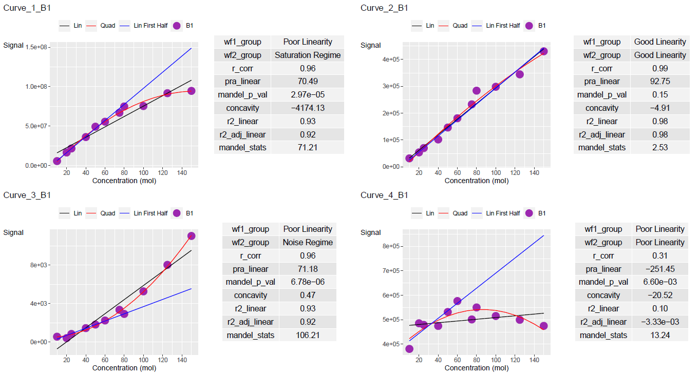

```{r, include = FALSE}
knitr::opts_chunk$set(
  collapse = TRUE,
  comment = "#>"
)
```

Here are some examples to plot curve data via `ggplot2`

```{r data set creation}
library(lancer)

# Data Creation

concentration <- c(
  10, 20, 25, 40, 50, 60,
  75, 80, 100, 125, 150,
  10, 25, 40, 50, 60,
  75, 80, 100, 125, 150
)

curve_batch_name <- c(
  "B1", "B1", "B1", "B1", "B1",
  "B1", "B1", "B1", "B1", "B1", "B1",
  "B2", "B2", "B2", "B2", "B2",
  "B2", "B2", "B2", "B2", "B2"
)

sample_name <- c(
  "Sample_010a", "Sample_020a",
  "Sample_025a", "Sample_040a", "Sample_050a",
  "Sample_060a", "Sample_075a", "Sample_080a",
  "Sample_100a", "Sample_125a", "Sample_150a",
  "Sample_010b", "Sample_025b",
  "Sample_040b", "Sample_050b", "Sample_060b",
  "Sample_075b", "Sample_080b", "Sample_100b",
  "Sample_125b", "Sample_150b"
)

curve_1_saturation_regime <- c(
  5748124, 16616414, 21702718, 36191617,
  49324541, 55618266, 66947588, 74964771,
  75438063, 91770737, 94692060,
  5192648, 16594991, 32507833, 46499896,
  55388856, 62505210, 62778078, 72158161,
  78044338, 86158414
)

curve_2_good_linearty <- c(
  31538, 53709, 69990, 101977, 146436, 180960,
  232881, 283780, 298289, 344519, 430432,
  25463, 63387, 90624, 131274, 138069,
  205353, 202407, 260205, 292257, 367924
)

curve_3_noise_regime <- c(
  544, 397, 829, 1437, 1808, 2231,
  3343, 2915, 5268, 8031, 11045,
  500, 903, 1267, 2031, 2100,
  3563, 4500, 5300, 8500, 10430
)

curve_4_poor_linearty <- c(
  380519, 485372, 478770, 474467, 531640, 576301,
  501068, 550201, 515110, 499543, 474745,
  197417, 322846, 478398, 423174, 418577,
  426089, 413292, 450190, 415309, 457618
)

curve_batch_annot <- tibble::tibble(
  Sample_Name = sample_name,
  Curve_Batch_Name = curve_batch_name,
  Concentration = concentration
)

curve_data <- tibble::tibble(
  Sample_Name = sample_name,
  `Curve_1` = curve_1_saturation_regime,
  `Curve_2` = curve_2_good_linearty,
  `Curve_3` = curve_3_noise_regime,
  `Curve_4` = curve_4_poor_linearty
)

curve_table <- lancer::create_curve_table(
  curve_batch_annot = curve_batch_annot,
  curve_data_wide = curve_data,
  common_column = "Sample_Name",
  signal_var = "Signal",
  column_group = "Curve_Name"
)

curve_classified <- curve_table %>%
  lancer::summarise_curve_table(
    grouping_variable = c(
      "Curve_Name",
      "Curve_Batch_Name"
    ),
    conc_var = "Concentration",
    signal_var = "Signal"
  ) %>%
  dplyr::arrange(.data[["Curve_Name"]]) %>%
  lancer::evaluate_linearity(
    grouping_variable = c(
      "Curve_Name",
      "Curve_Batch_Name"
  ))
```

Here is the output of `curve_table` and `curve_classified` 

```{r print curve data}
print(head(curve_table), width = 100)
print(head(curve_classified), width = 100)
```

To see the regression line on half the curve points, set `plot_first_half_lin_reg = TRUE`

```{r create ggplot table with half linear regression}
ggplot_table <- lancer::add_ggplot_panel(
  curve_table = curve_table,
  curve_summary = curve_classified,
  grouping_variable = c(
    "Curve_Name",
    "Curve_Batch_Name"
  ),
  curve_batch_var = "Curve_Batch_Name",
  curve_batch_col = c(
    "#377eb8",
    "#4daf4a"
  ),
  conc_var = "Concentration",
  conc_var_units = "%",
  conc_var_interval = 50,
  signal_var = "Signal",
  plot_first_half_lin_reg = TRUE
)

ggplot_list <- ggplot_table$panel
```

```{r print ggplot plot with half linear regression}
#| fig.alt = "A ggplot of the Curve_1_B1's curve
#|  and curve statistics. A linear regression line
#|  which fits the first half of the curve points
#|  is added.
#|  This is the first row of the column panel."
ggplot_list[[1]]
```

Units of `conc_var` and `conc_var_interval` can be customised to suit the range of `conc_var`
You can also change the colours for your dilution batch from `curve_batch_col` 

```{r create ggplot table with conc customisation}
ggplot_table <- lancer::add_ggplot_panel(
  curve_table = curve_table,
  curve_summary = curve_classified,
  grouping_variable = c(
    "Curve_Name",
    "Curve_Batch_Name"
  ),
  curve_batch_var = "Curve_Batch_Name",
  curve_batch_col = c(
    "#9C27B0",
    "#377eb8"
  ),
  conc_var = "Concentration",
  conc_var_units = "mol",
  conc_var_interval = 20,
  signal_var = "Signal",
  plot_first_half_lin_reg = TRUE
)

ggplot_list <- ggplot_table$panel
```

```{r print ggplot plot with conc customisation 1}
#| fig.alt = "A ggplot of the Curve_2_B1's curve
#|  and curve statistics. The curve points colour,
#|  concentration interval and units are customised.
#|  This is the second row of the column panel."
ggplot_list[[2]]
```

```{r print ggplot plot with conc customisation 2}
#| fig.alt = "A ggplot of the Curve_4_B2's curve
#|  and curve statistics. The curve points colour,
#|  concentration interval and units are customised.
#|  This is the eighth row of the column panel."
ggplot_list[[8]]
```

The list of `ggplots` can be output in pdf. You may have to adjust the width and height accordingly.

```{r create pdf page, eval = FALSE}
lancer::view_ggplot_pdf(
  ggplot_list = ggplot_list,
  filename = "curve_plot.pdf",
  ncol_per_page = 2,
  nrow_per_page = 2,
  width = 15, height = 8
)
```

```{r PDF Results 1, echo = FALSE}
#| fig.alt = "Curve batch one's statistics
#|  summary and plots reported in pdf using lancer.
#|  Pdf page width and height are customised."


```

```{r PDF Results 2, echo = FALSE}
#| fig.alt = "Curve batch two's statistics
#|  summary and plots reported in pdf using lancer.
#|  Pdf page width and height are customised."

knitr::include_graphics("vignettes-pdfoutput2.png")
```
