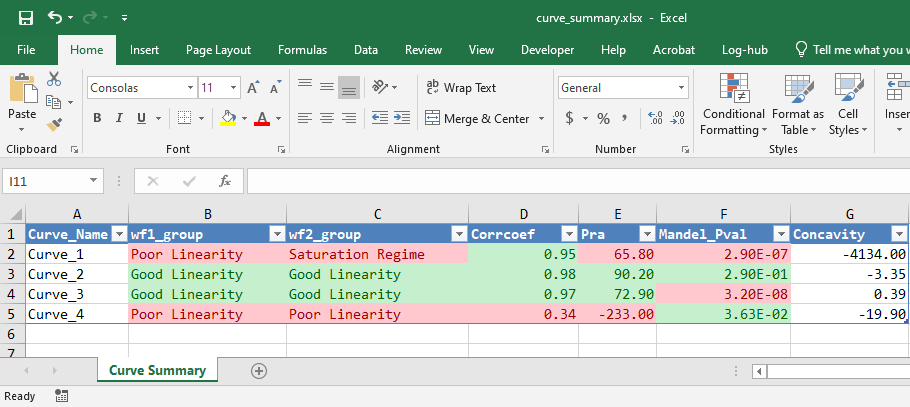

```{r, include = FALSE}
knitr::opts_chunk$set(
  collapse = TRUE,
  comment = "#>"
)
```

By default the function `evaluate_linearity` will look for column names
`r_corr`, `pra_linear`, `mandel_p_val` and `concavity_column` that represent 
the Correlation Coefficient, Percent Residual Accuracy and Mandel's Fitting Test 
p value respectively.

It is possible to change the column names representing the three parameters
to suit your own dataset using `corrcoef_column`, `pra_column`, `mandel_p_val_column` and `concavity_column`

```{r customisation setup}
library(DCVtestkit)

transition_name <- c("Lipid1", "Lipid2", "Lipid3", "Lipid4")
corrcoef <- c(0.952, 0.978, 0.971, 0.344)
pra <- c(65.8, 90.2, 72.9, -233)
mandel_pval <- c(0.00000029, 0.290, 0.000000032, 0.0363)
concavity <- c(-4134, -3.35, 0.394, -19.9)

dilution_summary <- tibble::tibble(
  Transition_Name = transition_name,
  Corrcoef = corrcoef,
  Pra = pra,
  Mandel_Pval = mandel_pval,
  Concavity = concavity
)
```

```{r different column names}

dilution_classified <- evaluate_linearity(
  dilution_summary = dilution_summary,
  grouping_variable = c(
    "Transition_Name"
  ),
  corrcoef_column = "Corrcoef",
  pra_column = "Pra",
  mandel_p_val_column = "Mandel_Pval",
  concavity_column = "Concavity"
)
```

```{r print evaluation with different column names}
print(dilution_classified, width = 100)
```

One can change the threshold of the Correlation Coefficient (0.8), 
Percent Residual Accuracy (80) and Mandel's Fitting Test p value (0.05) using
`corrcoef_min_threshold`, `pra_min_threshold` and `mandel_p_val_threshold` 
respectively.


```{r different threshold}

dilution_classified <- evaluate_linearity(
  dilution_summary = dilution_summary,
  grouping_variable = c(
    "Transition_Name"
  ),
  corrcoef_column = "Corrcoef",
  corrcoef_min_threshold = 0.7,
  pra_column = "Pra",
  pra_min_threshold = 70,
  mandel_p_val_column = "Mandel_Pval",
  mandel_p_val_threshold = 0.01,
  concavity_column = "Concavity"
)
```

```{r print evaluation with different threshold}
print(dilution_classified, width = 100)
```

Likewise for the excel output using the function `write_summary_excel`, we can choose which
column to be Correlation Coefficient, Percent Residual Accuracy and Mandel's Fitting Test p value, 
as well as its threshold value. The sheet name can also be changed.

```{r customise print to excel, eval = FALSE}
write_summary_excel(
  dilution_summary = dilution_classified,
  file_name = "dilution_summary.xlsx",
  sheet_name = "Dilution Summary",
  corrcoef_column = "Corrcoef",
  corrcoef_min_threshold = 0.7,
  pra_column = "Pra",
  pra_min_threshold = 70,
  mandel_p_val_column = "Mandel_Pval",
  mandel_p_val_threshold = 0.01,
  workflow1_column = "wf1_group",
  workflow2_column = "wf2_group",
  pass_criteria_words = c("Good Linearity")
)
```


