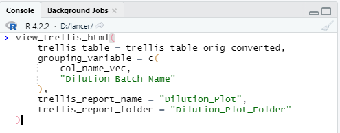
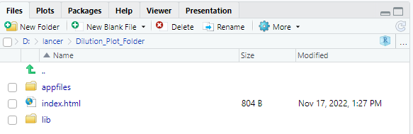

```{r, include = FALSE}
knitr::opts_chunk$set(
  collapse = TRUE,
  comment = "#>",
  message = FALSE,
  warning = FALSE
)
```

Here is an example to output plot in `ggplot2` into trellis. The example in `plotly` can be found
in vignette "Plots in plotly".

```{r data set creation}
library(lancer)

# Data Creation

concentration <- c(
  10, 20, 25, 40, 50, 60,
  75, 80, 100, 125, 150,
  10, 25, 40, 50, 60,
  75, 80, 100, 125, 150
)

curve_batch_name <- c(
  "B1", "B1", "B1", "B1", "B1",
  "B1", "B1", "B1", "B1", "B1", "B1",
  "B2", "B2", "B2", "B2", "B2",
  "B2", "B2", "B2", "B2", "B2"
)

sample_name <- c(
  "Sample_010a", "Sample_020a",
  "Sample_025a", "Sample_040a", "Sample_050a",
  "Sample_060a", "Sample_075a", "Sample_080a",
  "Sample_100a", "Sample_125a", "Sample_150a",
  "Sample_010b", "Sample_025b",
  "Sample_040b", "Sample_050b", "Sample_060b",
  "Sample_075b", "Sample_080b", "Sample_100b",
  "Sample_125b", "Sample_150b"
)

curve_1_saturation_regime <- c(
  5748124, 16616414, 21702718, 36191617,
  49324541, 55618266, 66947588, 74964771,
  75438063, 91770737, 94692060,
  5192648, 16594991, 32507833, 46499896,
  55388856, 62505210, 62778078, 72158161,
  78044338, 86158414
)

curve_2_good_linearty <- c(
  31538, 53709, 69990, 101977, 146436, 180960,
  232881, 283780, 298289, 344519, 430432,
  25463, 63387, 90624, 131274, 138069,
  205353, 202407, 260205, 292257, 367924
)

curve_3_noise_regime <- c(
  544, 397, 829, 1437, 1808, 2231,
  3343, 2915, 5268, 8031, 11045,
  500, 903, 1267, 2031, 2100,
  3563, 4500, 5300, 8500, 10430
)

curve_4_poor_linearty <- c(
  380519, 485372, 478770, 474467, 531640, 576301,
  501068, 550201, 515110, 499543, 474745,
  197417, 322846, 478398, 423174, 418577,
  426089, 413292, 450190, 415309, 457618
)

curve_batch_annot <- tibble::tibble(
  Sample_Name = sample_name,
  Curve_Batch_Name = curve_batch_name,
  Concentration = concentration
)

curve_data <- tibble::tibble(
  Sample_Name = sample_name,
  `Curve_1` = curve_1_saturation_regime,
  `Curve_2` = curve_2_good_linearty,
  `Curve_3` = curve_3_noise_regime,
  `Curve_4` = curve_4_poor_linearty
)

curve_table <- lancer::create_curve_table(
  curve_batch_annot = curve_batch_annot,
  curve_data_wide = curve_data,
  common_column = "Sample_Name",
  signal_var = "Signal",
  column_group = "Curve_Name"
)

curve_classified <- curve_table %>%
  lancer::summarise_curve_table(
    grouping_variable = c(
      "Curve_Name",
      "Curve_Batch_Name"
    ),
    conc_var = "Concentration",
    signal_var = "Signal"
  ) %>%
  dplyr::arrange(.data[["Curve_Name"]]) %>%
  lancer::evaluate_linearity(
    grouping_variable = c(
      "Curve_Name",
      "Curve_Batch_Name"
  ))
```

Here is the output of `curve_table` and `curve_classified` 

```{r print curve data}
print(head(curve_table), width = 100)
print(head(curve_classified), width = 100)
```

We then create the `ggplot` plots with `curve_table` and `curve_classified`

```{r create ggplot table}
# Create a trellis table
trellis_table_orig <- lancer::add_ggplot_panel(
  curve_table = curve_table,
  curve_summary = curve_classified,
  grouping_variable = c(
    "Curve_Name",
    "Curve_Batch_Name"
  ),
  curv_batch_var = "Curve_Batch_Name",
  curv_batch_col = c(
    "#377eb8",
    "#4daf4a"
  ),
  conc_var = "Concentration",
  conc_var_units = "%",
  conc_var_interval = 50,
  signal_var = "Signal",
  plot_first_half_lin_reg = FALSE
)

trellis_list_orig <- trellis_table_orig$panel
```

To output these plots as a trellis in html, convert the `grouping_variable` as `conditional variable`, the column
holding the plots as a `panel_variable` and the other columns as common cognostics.

We use the function `convert_to_cog` which uses the default `cog_df` 
created by `create_default_cog_df`.

```{r print default cog_df}
lancer::create_default_cog_df()
```

Using the function `convert_to_cog`,

```{r adding default cognostics}
trellis_table_convert <- trellis_table_orig %>%
  lancer::convert_to_cog(
    grouping_variable = c(
      "Curve_Name",
      "Curve_Batch_Name"
    ),
    panel_variable = "panel"
  )
```

The output is as follows.

```{r converted default cognostics}
print(head(trellis_table_convert), width = 100)
```

Observe that the attributes of the columns are different.
For the grouping variable column labelled we have

```{r converted default cognostics conditional}
print(attributes(trellis_table_convert$Curve_Name))
```

For the column labelled as a `panel_variable`, we have

```{r converted default cognostics panel}
print(attributes(trellis_table_convert$panel))
```

For the rest of the column converted to a common cognostics, we have

```{r converted default cognostics common}
print(attributes(trellis_table_convert$r_corr))
```

It is also possible for users to create their own cognostics as well.

```{r adding custom annotations and cognostics}
curve_name <- c("Curve_1", "Curve_2", "Curve_3", "Curve_4")
curve_class <- c("Class_1", "Class_1", "Class_2", "Class_2")

curve_name_annot <- tibble::tibble(
  Curve_Name = curve_name,
  Curve_Class = curve_class
)

col_name_vec <- c("Curve_Name", "Curve_Class")

desc_vec <- c(
  "Names of Curves",
  "Classes of Curves"
)

type_vec <- c("factor", "factor")

cog_df <- data.frame(
  col_name_vec = col_name_vec,
  desc_vec = desc_vec,
  type_vec = type_vec
)

trellis_table_orig_converted <- trellis_table_orig %>%
  dplyr::left_join(curve_name_annot, by = "Curve_Name") %>%
  lancer::convert_to_cog(
    cog_df = cog_df,
    grouping_variable = c(
      col_name_vec,
      "Curve_Batch_Name"
    ),
    panel_variable = "panel",
    col_name_vec = "col_name_vec",
    desc_vec = "desc_vec",
    type_vec = "type_vec"
  )
```

The list of `ggplots` can be output as follows by calling this command
in the R console:

```{r create trellis page, eval = FALSE}
lancer::view_trellis_html(
  trellis_table = trellis_table_orig_converted,
  grouping_variable = c(
    col_name_vec,
    "Curve_Batch_Name"
  ),
  trellis_report_name = "Curve_Plot",
  trellis_report_folder = "Curve_Plot_Folder"
)
```

```{r Rstudio Command, echo = FALSE}
#| fig.alt = "Code copied to the R Studio
#|  console."


```

This will create a folder called “Curve_Plot_Folder” as defined by `trellis_report_folder` in your current working directory.

```{r Output Folder, echo = FALSE}
#| fig.alt = "Folder named Dilution_Plot_Folder
#|  is created when code is successfully executed."


```

You may view the plots by clicking on "index.html"

```{r html plotly, echo = FALSE}
#| fig.alt = "An interactive
#|  trelliscope output created when the
#|  index.html file is clicked."

knitr::include_graphics("vignettes-htmlggplot.png")
```

